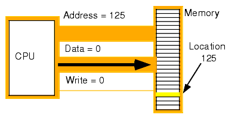
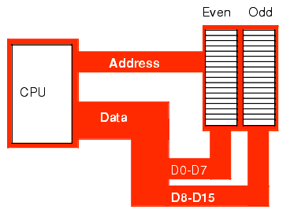

# 3.2 A Memória

#### Próximo: [3.3 Entradas e Saídas](./entradas_saidas.md)  
#### Anterior: [3.1 Os Barramentos](./barramentos.md)  

Um processador 80x86 endereça no máximo 2 elevado a n diferentes localizações. com _n_ sendo o número de bits do barramento de endereço. A unidade mais básica de memória é um byte. Portanto, com 20, 24 e 32 linhas de endereços, o processador 80x86 pode endereçar 1Mb, 16 Mb e 4Gb de memória respectivamente.  
O que acontece então quando o processador acessa uma palavra binária ou palavra binária dupla. Se a memória é um array de bytes, como podemos lidar com valores maiores que 8 bytes?  

Cada sistema lida com este problema de uma maneira. Na família 80x86 o problema é resolvido armazenando o  byte de baixa ordem em um endereço especificado e o byte  de alta ordem na próxima localização (sendo assim, uma palavra consome dois endereços de memória consecutivos).

Podemos notar que um byte, uma palavra e uma palavra dupla podem acabar sobrescrevendo dados. Tomando como exemplo a próxima imagem,  temos uma palavra iniciando no endereço 193, um byte no endereço 194 e uma palavra dupla no endereço 192. Essas variáveis podem todas se sobrescreverem.  

* Array de memória endereçado por byte  
O termo _array de memória endereçado por byte_ quer dizer que o processador pode endereçar espaço na memória com o menor pedaço sendo de 1 byte. Isso significa também que a menor unidade de memória que você pode acessar de cada vez em um processador é essa: 1 byte. Ou seja, se o processador quiser acessar 4 bits de um valor qualquer, ele deverá primeiro ler os 8 bits do byte correspondente e então ignorar os 4 bits excedentes. Tenha em mente também que um _endereçamento por byte_ não implica no fato do processador acessar 8 bits de qualquer posição arbitrária. Quando é especificado, por exemplo, o endereço 125 na memória, você terá todos os bits DESTE ENDEREÇO, nem mais, nem menos.  
Os endereços são números inteiros: você não pode especificar o endereço 125,5 para acessar menos do que 8 bits.  

---  
* Processadores de 16 bits  

Os processadores 8086, 80186, 80286 e 80386sx possuem barramentos de dados de 16 bits. Isso pertime que esses processadores acessem duas vezes mais memória no mesmo espaço de tempo que seus companheiros de 8 bits. Estes processadores organizam a memoria em duas partes (**banks**): um bank "par" e um bank "ímpar". Na imagem abaixo, o processador coloca em DO-D7 os bytes de baixa ordem e em D8-D15 os de alta ordem.  

  

Os membros de 16 bits da família 80x86 podem carregar uma palavra de um endereço arbitrário. Anteriormente foi mencionado que o procesasdor busca o byte de baixa ordem no endereço especificado e o de alta ordem fica armazenado no endereço seguinte. Isso cria um problema quando você olha este sistema de perto: _o que acontece quando você acessa uma palavra com um endereço ímpar?_ Suponha que você queira ler uma palavra do endereço 125: ok, o byte de baixa ordem vem do endereço 125 e o de alta ordem do endereço 126, qual o problema? Existem dois problemas nessa situação:  

Observe novamente a figura anterior. O barramento de dados  D8-D15 se conecta ao bank ímpar (odd - local dos bytes de alta ordem) e o barramento D0-D7 se conecta ao bank par (even 0 local dos bytes de baixa ordem). Acessamento a memória através do endereço 125, iremos tranferir dados para o processador do byte de alta ordem, mesmo nós querendo os dados do byte de baixa ordem. Felizmente, o 80x86 reconhece esta situação e automaticamente transfere o dado a partir do byte de baixa ordem.  Contudo, temos um segundo problema um pouco mais obscuro: quando acessamos palavras, estamos na verdade acessando dois bytes distintos, cada um com seu próprio endereço. Assim surge a pergunta "_qual endereço aparece no barramento de endereço?_ Os processadores 16 bits da família 80x86 sempre utilizam os endereços pares no barramento. Se você acessar uma palavra em um endereço par, o processador pode lhe trazer o conteúdo todo de 16 bits em uma operação de memória. Já se você quiser acessar um único byte, o processador ativa o bank apropriado (utilizando uma linha de controle **"byte enable"**). Se o byte estiver em um endereço ímpar, o processador irá automaticamente movê-lo para posição de byte de baixa ordem.  

* Procesadores de 32 bits  

Os processadores de 32 bits utilizam **4 banks** conectados ao barramento de dados de 32 bits. O endereço colocado no barramento de endereços é sempre um múltiplo de 4. Utilizando várias linhas de "byte enable", o processador pode selecionar qual dos quatro bytes daquele endereço o softwaer quer acessar. Assim como no processador de 16 bits, o de 32 bits irá reajustar os bytes automaticamente, se necessário.  

  

Com uma interface de memória de 32 bits, o processador 80x86 pode acessar qualquer byte com uma operação de memória.  Ele pode acessar uma palavra dupla em uma operação de memória **se** o endereço daquele valor for divisível por quatro. Caso não, o processador irá precisar de duas operações de memória.  

Se o módulo da divisão do endereço por 4 não for igual a 3, então um processador de 32 bits pode acessar uma palavra de qualquer endereço utilizando apenas uma operação de memória. Caso contrário, se o módulo for 3, então leverá duas operações de memória para acessar a palavra. É o mesmo problema encontrado em processadores de 16 bits.  

O processador geralmente lida com esses problemas automaticamente no sentido de carregar o dado correto, porém utilizando as especificações de dados corretamente ajuda muito na performance. Como regra geral, você deve sempre armazenar palavras em endereços pares e palavras duplas em endereços divisíveis por 4. Isso irá acelerar a performance do seu desenvolvimento.