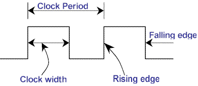
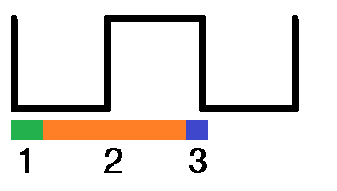
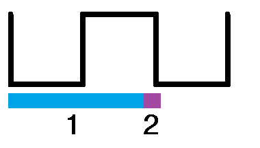

# 3.4 O Clock  

#### Próximo: [3.5 Estado de Espera](./estado_espera.md)  
#### Anterior: [3.3 Entradas e Saídas](./entradas_saidas.md)  

---  
Mesmo que os computadores modernos estejam cada vez mais rápidos eles ainda preisam de uma quantidade de tempo finita para completar até mesmo as menores tarefas. Em máquina de arquitetura Von neumann, como os 80x86, a maioria das operações são **seriadas**. Isso significa que o computador executa suas ações em uma determinada ordem. Sendo assim _"Como o processador executa tarefas e como sabemso quanto tempo levaram para ser executadas?"_.  

O processador é um componente eletrônico muito complexo que coordenado de maneira errada produzirá resultados errôneos. Para garantir que todoas as operações ocorram no momento certo, os 80x86 utilizam um sinal chamado **CLOCK**.  

O clock é um sinal elétrico do barramento de controle que altera entre 0 e 1 a uma tava periódica fixa. Ele é o responsável por garantir que o processador trabalhe de forma sincronizada.  

  

A frequência com a qual o clock se alterna entre zero e um é chamada de **frequência do clock** e o tempo que ele leva para sair do 0, ir até 1 e voltar para o 0 é chamado de **período do clock ou ciclo**.  

Para garantir a sinronia, a maioria das CPUs iniciam uma operação no _falling edge_ (ver imagem anterior) ou no _rising edge_.  O clock fica a maior parte do tempo em zero ou um e pouquíssimo tempo no espaço de transição, portanto é o ponto ideal para sincronia.  
Como todas as operações utilizam o clock como referência, a CPU não pode realizar tarefas que excedam o clock. Porém, não é porque o processador possui o clock em uma frequência específica que ele está executando todas as operações naquele tempo. Muitas operações levam muitos ciclos para serem completas, sendo assim, a CPU geralmente realiza operações a uma taxa menor.  

## Acesso a memória e o Clock  

Acesso a memória é provavelmente a atividade mais comum do processador. Este tipo de acesso é definitivamente uma operação sincronizada pelo clock, ou seja, ler ou escrever um valor na memória ocorre não mais do que uma vezes a cada ciclo. Porém, em diversas operações da família 80x86 leva-se vários ciclos para se acessar um local na memória. O _tempo de acesso da memória_ é o número de ciclos que o sistema precisa para acessar uma localização na memória. Este é um valor importante sendo que valores muito altos desse parâmetro leva a performances lentas.  

Diferentes processadores 80x86 possuem diferentes tempos de acesso a memória variando de 1 até 4 ciclos de clock. Por exemplo, o 8088 e 8086 precisam de 4 clocks para acessar a memória; o 80486 necessita de apenas um. Portanto, o 80486 podem executar programas que acessam a memória mais rápido que o 8086, mesmo rodando na mesma frequência de clock.  

  

Acima temos um pulso de clock representando o ciclo de leitura do 80486. Conforme mostrado, temos:  
1. A CPU coloca o endereço no barramento de endereços durante esta etapa,  
2. A memória deve decodificar o endereço e colocar o dado no barramento de dados nesse momento,  
3. A CPU lê o dado do barramento de dados nesta etapa.  

  
Acima temos o pulso de clock representando o clico de escrita do 80486. Conforme mostrado, temos:  
1. A CPU coloca o endereço e os dados nos respectivos barramentos neste momento,  
2. Nesta etapa a memória deve ler e armazenar o dado recebido.  

Os dispositivos de memória possuem diversas características, mas as duas principais são a capacidade e a velocidade (tempo de acesso). Uma memória RAM (_random access memory_) possui a capacidade de de 4 ou mais megabytes e velocidades entre 50-100ns. Um 80486 de 33MHz típico utiliza memórias de 70ns.  

Mas espere um pouco: com 33 MHz de clock o ciclo é aproximadamente 33ns. Como então devemos considerar 70ns? A resposta é o **estado de espera** (wait states).

