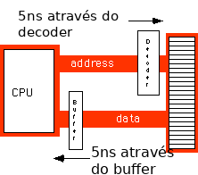
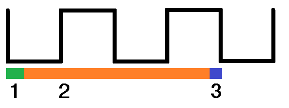

# 3.5 Estado de Espera

#### Próximo: [3.6 Memória Cache](./cache.md)  
#### Anterior: [3.4 O Clock](./clock.md)  

---  

O Estado de Espera nada mais é do que um ciclo de clock extra para dar ao dispositivo mais tempo para completar uma operação. Por exemplo, um sistema 80486 de 50MHz possui 20ns de período de clock. Isso pode implicar que você precise de uma memória de 20ns, mas na verdade a situação é pior do que esta: na maioria dos sistemas computacionais existe um circuito adicional ente a CPU e a memória. São as lógicas de buffer e decodificação. Essas camadas adicionais introduzem atrasos no sistema.

  

Como podemos ver na imagem de exemplo, o sistema perde 10ns para realizar o buffer e a decodificação. Então se a CPU precisa que o dado seja retornado em 20ns, a memória deve responder em no máximo 10ns.  
Os custos de alguns tipos de memória podem tornar alguns sistemas proibitivos. Sendo assim, como as empresas trabalham com isso para vender computadores? Uma parte da resposta é o Estado de Espera. Por exemplo, se você possui um processador de 20MHz com um ciclo de memória de 50ns e você perde 10ns para o buffer e decodificação, você precisará de uma memória de 40ns. E se você puder comprar apenas uma memória de 80ns para um sistema de 20 MHz? Neste caso, você adiciona um **Estado de Espera** para extender o ciclo para 100ns (dois ciclos de clock) para resolver o problema. Subtraindo os 10ns utilizados pelo buffer e decodificação, temos 90ns. Portanto, uma memória de 80ns irá responder bem antes de uma CPU precisar do dado.  

Praticamente todas as CPUs de uso geral possuem um sinal no barramento de controle que permite a inserção de Estados de Espera. Geralmente, o circuito de decodificação define essa condição para 1 clock, se necessário. Isso dá a memória tempo de acesso suficiente e o sistema funciona conforme esperado.  Algumas vezes um único Estado de Espera não pe o suficiente. Considere um 80486 rodando a 50MHz. O ciclo normal de memória é menos de 20ns. Porém, menos de 10ns ficam disponíveis após subtrair as etapas de decodificação e buffer. Se você está utilizando uma memória de 60ns, adicionar um Estado de Espera não resolverá o problema. Cada Estado lhe dá 20ns, portanto, com apenas 1 Estado de espera você precisará de uma memória de 30ns. Para trabalhar com a memória de 60ns você precisará de 3 Estados de Espera (zero = 10ns, um = 30ns, dois = 50ns, três = 70ns).  

Salientando que do ponto de vista de performance, os Estado de Espera não são uma coisa boa. Enquanto a CPU está esperando o dado da memória, ela nao pode operar no dado.  

  

Em resumo, seguindo a imagem temos a seguinte condição:  
1. A CPU coloca o endereço no barramento de endereços durante esta etapa.  
2. O sistema de memória deve decodificar o endereço e colocar o dado no barramento de dados durante esta etapa. Se um ciclo de clock for insuficiente, o sistema adiciona um segundo ciclo, chamado Estado de Espera.  
3. A CPU lê o dado do barramento de dados nesta etapa.  

Adicionar um único Estado de Espera no ciclo de memória dobra o tempo necessário para acessar o dado. Ou seja, isso divide pela metade a velocidade de acesso à memória. Executar uma atividade com um estado de espera em todo acesso à memória é como cortar pela metade a frequência de clock do processador. É menos trabalho feito no mesmo período de tempo.  

É possível, em certas condições, gerenciar a operação com o menor número de estados de espera possíveis. Existem alguns truques que podem nos ajudar a chegar à zero Estados de Espera na **maioria** das vezes. O mais comum dos truques se chama **CACHE**.