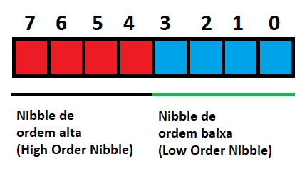
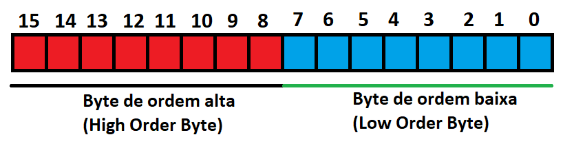
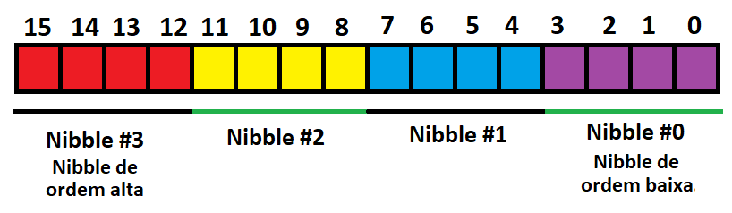

<link rel="stylesheet" href="css/style.css">

# 1.1 Bit, Nibble, Byte, Word

#### Anterior: [1.Binários e Hexadecimais](./binarios.md)
#### Próximo: [1.2 Operações Lógicas](./operacoes_logicas.md)

---

## Bit:  
A menor unidade binária que temos é o bit. Ele representa apenas um dígito, podendo ser 0 ou 1. Pensando em lógica de programação, estes dois estados podem representar uma infinidade de situações: ligado/desligado, verdadeiro/falso, alto/baixo, etc.  
  
## Nibble:  
O Nibble é um conjunto de quatro bits. O Nibble é importante porque como pudemos ver na tabela de conversão entre binários e hexadecimais, com 4 bits podemos representar todos os dígitos hexadecimais.  
  
## Byte:  
Um byte é composto de 8 bits. É de longe a estrutura binária mais conhecida e geralmente o menor item que pode ser acessado individualmente (quando falamos de microprocessadores e microcontroladores, por exemplo). Até podemos manipular bits individualmente, porém devemos utilizar operações que "mascaram" os bits que não queremos alterar em um byte.  
Outra coisa que podemos observar é que um Byte é composto de dois Nibbles.

Numerando-os da direita para esquerda, o nibble com os índices de menor valor é chamado de *Nibble de Ordem Baixa* e o nibble com os índices maiores de *Nibble de Ordem Alta*.  

Como um Byte possui 8 dígitos podemos concluir que temos 2 elevado à 8 possibilidades de combinações, ou seja, podemos representar 256 valores com um byte. Geralmente definidos de 0 à 255.

## Word:

Uma word (palavra) é um conjunto de 16 bits, ou seja, dois bytes também classificados como ordem alta e baixa:

Como cada Byte são dois Nibbles sabemos então que é formado por 4 nibbles dispostos e definidos da seguinte forma:

Com uma Word conseguimos representar 65536 valores diferentes (2 elevado à 16). Em alguns casos também é utilizado o Double Word que é uma Word com 32 bits. Neste caso, segue-se o mesmo padrão de nomenclaturas da Word, porém considerando 4 bytes, e 8 nibbles.