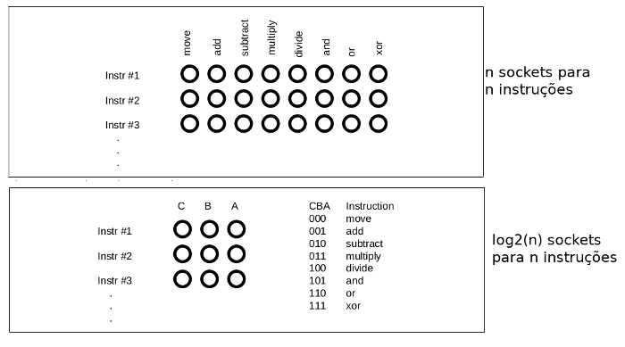

# 3.7 Registradores

#### Próximo: [3.8 xxx](./xxx.md)  
#### Anterior: [3.6 Memória Cache](./cache.md)  

---  

Os Registradores são locais **muito especiais** de memória construidos com flip-flops. Não são parte da memória principal; eles são implementados no processador (on-chip). Vários membros da família 80x86 possuem diferentes tamanhos de registradores. No caso dos 886, 8286, 8486 e 8686 (apenas x86 daqui em diante) possuem exatamente 4 registradores, todos de 16 bits. **Todas as operações aritméticas e de localização ocorrem nos registradores da CPU.**  

Devido ao fato do processador ter tão poucos registradores, damos a cada registrador seu próprio nome e utilizamos eles ao invés de seu endereço. Os nomes são:  
* **AX** - O registrador _acumulador_  
* **BX** - O registrador _base_  
* **CX** - O registrador _contador_ de dados  
* **DX** - O registrador de _dados_  

Além dos registradores citados, que são visíveis ao programador, os x86 também possuem um ponteiro de instrução que contém o endereço da próxima instrução a ser executada. Também existe um registrador _flag_ que segura o resultado de uma comparação. A flag grava se um valor é menor que, igual ou maior que outro valor.  

Como os registradores existem on-chip e são manipulados especialmente pela CPU, eles são muito mais rápidos que a memória. Acessar o dado em um registrador geralmente leva zero ciclos de clock. Sendo assim, você deve tentar manter as variáveis nos registradores, mas eles continuam sendo lugares excelentes para armazenar dados temporários.  

## A Unidade de Controle e o Conjunto de Instruções  
Uma boa pergunta seria "Como exatamente uma CPU realiza tarefas programadas?" Isso acontece dando-se a CPU um conjunto fixo de comandos, ou instruções. Tenha em mente que os designers de CPU criam estes processadores utilizando portas lógicas para executar estas instruções. Para manter o número de portas lógicas para um conjunto pequeno, os designers devem  restringir o número e complexidade dos comandos que a CPU reconhece.  

Os programas da época anterior as máquinas de Von Neumann eram trabalhados através de circuitos, ou seja, as conexões dos computadores que determinaval qual tipo de problema ele poderia resolver. Caso necessário, deveria se alterar o circuito para alterar a programação. O próximo avanço nessa linha foram os sistemas _programáveis_. Estes sistemas permitiam que a máquina fosse pudesse ter seus circuitos facilmente alterados, utilizando uma sequência de sockets e cabos. Um programa de computador consistia em um conjunto de linhas com buracos (socket) cada uma representando uma operação durante a execução do programa. O programador podia selecionar uma das instruções plugando um cabo no respectivo socket para a instrução desejada. Claro que a maior dificuldade deste método é que o número de instruções possíveis é severamente limitado pelo número de sockets que poderiam ser conectados em cada linha. Contudo, os designers das CPUs rapidamente descobriram que com uma quantidade pequena de circuitos lógicos adicionais eles poderiam reduzir o número de sockets necessários de n sockets por n instruções para log2(n) sockets para n instruções. Eles fizeram isso atribuindo um _código numérico_ para cada instrução e então transformaram este código em número binário utilizando log2(n) sockets.  

  

Esta melhoria precisa de oito funções lógicas para decodificar os bits em A, B e C do painel, mas o circuito extra tinha um custo aceitável já que reduzia o número de sockets que deveriam ser repetidos em cada instrução.  
Claro que muitas CPU não são STANDALONE. Por exemplo, o comando _MOVE_ é um comando que move o dado de um local para outro. Sendo assim, a instrução _MOVE_ requer dois operandos: um operador de origem e um de destino.  Alguém que conceba processadores geralmente encapsuestas operações de origem e destino como parte da instrução de máquina. Alguns sockets correspondem ao operando de origem e outros de destino.  

Um dos avanços primários no desenvolvimento de computadores foi o conceito de _programa armazenado_. Um grande problema com a programação no patch panel é que o número de etapas do programa (instruções) é limitado ao número de linhas de sockets disponíveis na máquina. John Von Neumann e outros reconheceram a relação entre o socket no painel e os bits na memória; eles descobriram que poderiam armazenar equivalentes binários de um programa na memória principal e buscar cada programa na memória, carregá-la em um _registro decodificador_ especial que se conectaria diretamente  ao circuito de decodificação de instruções da CPU.  
O truque, na verdade, era adicionar ainda mais eletrônica a CPU. Esta eletrônica, a unidade de controle, busca códigos de instrução (também conhecidos como operações ou opcodes) de uma memória e move elas para o registrador de instruções de decodificação. A unidade de controçe contem registradores especiais, o ponteiro de instruão que contém o endereço de uma instrução executável.