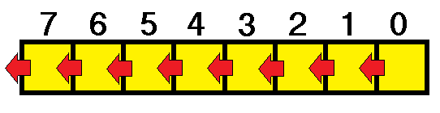
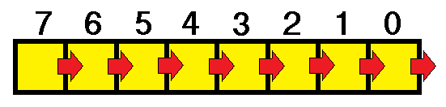
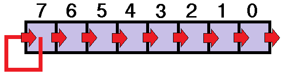
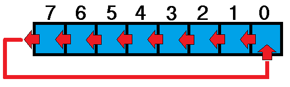
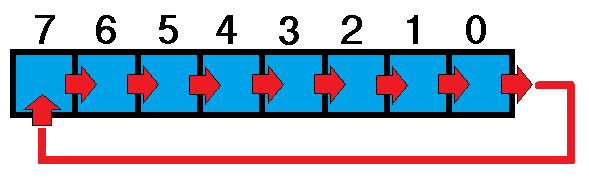

<link rel="stylesheet" href="css/style.css">

# 1.4 Shift (deslocamento) e Rotação

#### Anterior: [1.3 Sobre os Números Positivos e Negativos](./signed_unsigned.md)
#### Próximo: [1.5]()

---  

O shift e a rotação são operações muito comuns e úteis na operação de bits como veremos a seguir.

**SHIFT**  
 
A operação de shift consiste em mover os bits para a esquerda ou direita, conforme vemos abaixo  

   
-_Shift para Esquerda_ -  No shift para esquerda os bits são movimentados para o lado esquerdo. Vamos tomar como exemplo a movimentação de cada bit em uma posição. Após o deslocamento dos bits, o bit que estava presente na posição 7 é automaticamente descartado e a posição 0 será reposta com o valor zero. Quando realizamos esta operação, estamos automaticamente multiplicando este número  binário por 2 (sua base). Se movermos novamente a multiplicação total será 2 x 2 = 4.  
Ou seja, ao deslocar bits para esquerda **n** vezes, significa que estamos multiplicando aquele número por *2 elevado a n*.  

  

-_Shift para Direita_ - No caso do shift para a direita acontece exatamente o que imaginamos: o inverso da operação  para esquerda. Ou seja, ao invés de termos uma multiplicação teremos uma divisão por *2 elevado a n* posições em que os bits foram movidos.  

  

**SHIFT ARITMÉTICO**

Lembrando das operações de shift mencionadas anteriormente, podemos observar o seguinte exemplo:  
Temos o número decimal 254 (0FEh ou 1111 1110b). Se realizarmos o shift em uma posição para a direita teremos o número 127 (0EFh ou 0111 1111b) (metade do anterior conforme deduzimos). A questão é neste raciocínio estamos lidando com números naturais (apenas positivos)! E se quisermos fazer esta operação com números negativos (vimos números negativos na [seção anterior](./signed_unsigned.md)? Se 1 byte for utilizado para representar um número inteiro (positivo ou negativo), o valor real de 0FEh será -2. Porém ao realizar a operação de shift para direita passaríamos a ter o valor 127 já que o bit de alta ordem, o que simboliza o sinal númerico, se tornou zero, e não teremos o -1 esperado. Como resolver este problema?  
Para resolver esta questão existe o SHIFT ARITMÉTICO.  

  

Em essência o shift aritmético se assemelha ao shift para direita tradicional, porém nele o valor do bit de alta ordem não é modificado. Assim conseguimos manter o sinal destes números.  
Além disso podemos observar que não precisamos de um SHIFT ARITMÉTICO para esquerda, pois o shift para a esquerda tradicional já contempla o resultado correto tanto para números positivos quanto negativos.  

**ROTAÇÃO**  
Existem outros dois tipos de deslocamento de bits que são a rotação para a direita e a rotação para esquerda que vemos representados abaixo:  

  
Rotação para esquerda

  
Rotação para direita  

Este tipo de movimento é realizado quando não se quer perder nenhuma informação sobre os bits. Geralmente é utilizado em operações de encriptação de dados e abordaremos no futuro.
