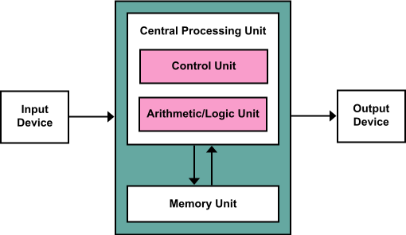

# 3. O Sistema x86 e sua Arquitetura

#### Próximo: [3.1 Os Barramentos](./barramentos.md)  

Esta seção descreve os componentes que formam um systema computacional: a CPU, memória, entradas e saídas como é realizada a conexão entre eles. Obviamente existem outras linguagens de programação no mercado que podem te ajudar a alcançar seus resultados esperados sem conhecer estes conceitos. Porém, softwares de alta performance precisam de um completo entendimento dessa etapa.  

---
Os sistemas x86 atuais utilizam a arquitetura de Von Neumann. Ela possui 3 componentes principais: a CPU, a memória e as entradas/saídas. Todo a ação de computação ocorre na CPU, os dados e as instruções da CPU ficam armazenados na Memória até serem requisitados pela CPU. Para a CPU os dispositivos de entrada/saída se parecem com a memória: são entidades as quais a CPU pode enviar ou receber dados. Obviamente a grande diferença está em que os dispositivos de entrada/saída são o que fazem a interface com o mundo exterior.  

  
Modelo de Von Neumann