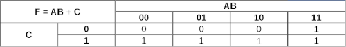

<link rel="stylesheet" href="css/style.css">

# 2.1 Tabelas Verdade e Funções Booleanas

#### Próximo: [2.2 Funções Booleanas e Circuitos Eletrônicos](./funcoes_e_circuitos.md)  
#### Anterior: [2. Álgebra Booleana](./algebra_booleana_intro.md)  

---  

Como descrito na área de [operações lógicas](./operacoes_logicas.md) cada operador booleano possui a sua **tabela verdade** que mostra suas saídas de acordo com a entrada de dois valores booleanos. Abaixo transcrevo novamente as tabelas verdade para os operadores AND (*), OR (+) e NOT ('):  

|AND|0|1|
|:---:|:---:|:---:|
|**0**|0|0|
|**1**|0|1|  

   

|OR|0|1|
|:---:|:---:|:---:|
|**0**|0|1|
|**1**|1|1|  

 

|NOT|0|1|
|:---:|:---:|:---:|
||1|0|  

Mas as expressões booleanas são se limitam apenas a duas entradas e uma saída. Muitas vezes são associadas diversas entradas, com diversas operações para gerar uma saída específica. Podemos então gerar Tabelas Verdade para todas as expressões como no exemplo abaixo, porém em alguns casos elas podem se tornar enormes.  

_Exemplo:_  F = AB + C  

  

OBS: Não entrarei no mérito de manipulação e simplificação de funções booleanas, pois não é o objetivo deste material se utilizar de teorias extensas. Contudo existe material vasto online e recomendo que busquem.