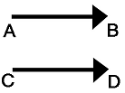

<link rel="stylesheet" href="css/style.css">

# 1. Vetores

_Premissas:_

* Quando falado de ponto, considerar todos os pontos de um espaço tridimensional da Geometria Euclidiana (que será chamada de _espaço_ e simbolizado por )
* Pontos serão sempre representados por letras maiúsculas, retas por letras minúsculas e planos por letras gregas minúsculas.

#### Próximo: [1.1](./adicao_vetores.md)

---

## Vetores  

Na física existem grandezas que podem ser representadas apenas por um número como 10kg ou 50m. Já outras, para serem melhor compreendidas devem ser passíveis de serem representadas de uma maneira que as descrevam de forma mais detalhada: além da grandeza numérica em si (intensidade, que chamaremos de módulo) também é necessário que saibamos sua direção e o seu sentido, como por exemplo no caso da velocidade, de uma força aplicada ou das componentes de um objeto em movimento circular.  

Estas grandezas que necessitam de "informação adicional" para serem interpretadas são chamadas de **grandezas vetoriais** e são representadas por flechas:  

  

O tamanho da flecha indica uma **intensidade**. A flecha em si é um segmento na qual foi fixada uam orientação, ou seja, foi definido um **sentido** e a sua posição indica uma **direção**.  

